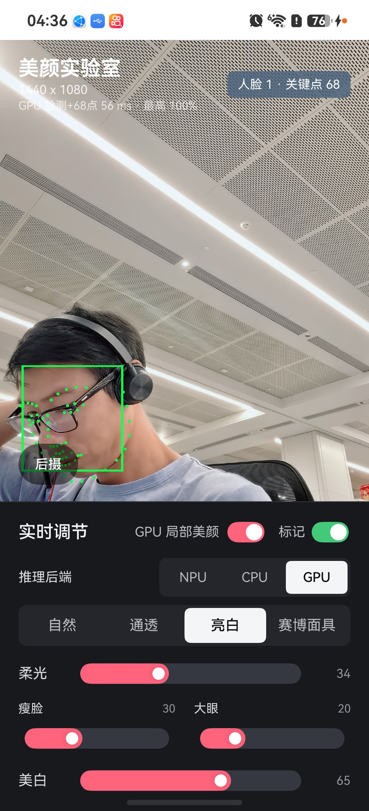

# NPU、CPU 与 GPU 人脸推理后端对比

> MNN-HiAI/NPU 后端的新增采集与四后端对比见 [mnn_npu_trace_analysis.md](mnn_npu_trace_analysis.md)。

## 1. 结论

在当前 HarmonyBeautyDemo、同一前摄和同一 OpenGL 美颜链路下：

- **NPU 综合最优**：总耗时平均 `42.4 ms`，P95 `50.0 ms`，应用平均占用 `0.69` 个 CPU 核。
- **CPU 次之**：总耗时平均 `65.2 ms`，比 NPU 慢 `53.9%`；应用平均占用 `0.92` 个 CPU 核。
- **当前 GPU 后端最慢**：总耗时平均 `79.8 ms`，比 NPU 慢 `88.4%`，比 CPU 慢 `22.4%`；P95 达到 `107.5 ms`。
- GPU 将应用 CPU 占用降到 `0.78` 核，低于 CPU 后端，但 GPU load、DDR、系统总忙度和大核频率都最高。
- GPU Trace 显示 OpenCL `runSession()` 主要是命令入队。人脸输出同步/回读平均约 `30.7 ms`，明显大于入队区间约 `6.0 ms`，是当前实现的首要问题。
- 关键点 ROI 预处理仍在 CPU，GPU 样本平均 `26.0 ms`；它没有因切到 OpenCL 而消失。

工程选择上，当前应保持 **NPU 为默认、CPU 为兼容回退**。GPU 后端适合继续做零拷贝、异步流水和图融合实验，暂不适合作为性能默认后端。

## 2. 测试对象与口径

| 项目 | 配置 |
|---|---|
| 应用版本 | `cade27d` 及 GPU Trace 分析器本地改动 |
| 输入 | 前摄预览，每 8 帧生成一张 `320 x 240` RGB Float32 分析帧 |
| 调度 | 每 180 ms 尝试一次；忙时不重入，只保留最新分析帧 |
| 人脸检测 | `version-slim-320-nofusion.ms` / 对应 MNN 模型 |
| 关键点 | `landmarks_68_pfld_nofusion.ms` / 对应 MNN 模型，68 点 |
| NPU | MindSpore Lite `target: ['nnrt']`，NNRT accelerator |
| CPU | MindSpore Lite `target: ['cpu']`，4 线程 |
| GPU | MNN 3.6 `MNN_FORWARD_OPENCL`，人脸和关键点两个 OpenCL Session |
| 公共链路 | 相机、FBO、`glReadPixels`、NCHW转换、SSD解码、ROI、关键点解码、美颜Shader |

### Demo现场



截图为 GPU 正式采集期间的前摄画面。界面中 GPU 后端处于选中状态，人脸框与 68 点关键点持续输出，亮白预设、实时美颜和标记开关处于测试配置。

每个后端均在前摄、亮白预设、实时美颜开启的情况下采集。GPU 在自检完成后预热约 10 秒，随后抓取 20 秒 hitrace；采集类别与 NPU/CPU 相同：

```text
app sched freq idle load membus memory memreclaim sync graphic power ipa irq workq
```

高频事件会覆盖环形缓冲区，因此最终有效 Trace 窗口分别为 NPU `6.624 s`、CPU `11.634 s`、GPU `10.388 s`。调度事件均按各自有效时长归一化。耗时日志是每 10 次推理打印一次，样本数分别为 16、15、12。

这不是固定视频逐帧回放，人物姿态和现场系统负载存在差异；结论适合工程选型和瓶颈定位，不等同于芯片峰值算力测试。

## 3. 调用链

### 3.1 公共输入

```text
Camera Surface
  -> BeautyRenderer::RenderFrame()
  -> CaptureFaceInput()
       -> FBO 缩放/letterbox 到 320 x 240
       -> glReadPixels(RGBA8888)
       -> C++ 转 RGB Float32 NCHW
       -> 单槽 faceInput_ 缓存
  -> ArkTS 180 ms timer
  -> beautyPipeline.consumeFaceFrame()
  -> Index.runFaceDetection()
```

### 3.2 NPU

```text
.ms -> mindSporeLite.loadModelFromBuffer(target=['nnrt'])
  -> MindSpore Lite NAPI -> NNRT -> HiAI -> Kirin NPU

MSTensor.setData()
  -> faceModel.predict()
  -> SSD 解码
  -> CPU 关键点 ROI 预处理
  -> landmarkModel.predict()
  -> 关键点解码
```

### 3.3 CPU

```text
.ms -> mindSporeLite.loadModelFromBuffer(target=['cpu'], threadNum=4)
  -> MindSpore Lite CPU executor

MSTensor.setData()
  -> CPU faceModel.predict()
  -> SSD 解码
  -> CPU 关键点 ROI 预处理
  -> CPU landmarkModel.predict()
  -> 关键点解码
```

### 3.4 GPU

```text
.mnn -> MNN::Interpreter::createFromBuffer()
  -> ScheduleConfig { type: OPENCL, backupType: OPENCL }
  -> createSession()
  -> getSessionInfo(BACKENDS) == OPENCL(3)

ArkTS runGpuFace()
  -> NAPI -> GpuFaceInference::RunFace()
  -> copyFromHostTensor()
  -> runSession()
  -> copyToHostTensor(scores/boxes)
  -> SSD 解码
  -> CPU 关键点 ROI 预处理
  -> runGpuLandmarks()
  -> copyFromHostTensor() -> runSession() -> copyToHostTensor()
  -> 关键点解码
```

GPU 初始化日志已确认 `MNN OpenCL backend=3`，不会静默回退 CPU。进程同时加载系统 `libOpenCL.so`。

## 4. 端到端推理耗时

| 指标 | NPU | CPU | GPU |
|---|---:|---:|---:|
| 日志样本数 | 16 | 15 | 12 |
| 人脸检测平均 | 7.9 ms | 18.7 ms | 39.7 ms |
| 68点阶段平均 | 34.4 ms | 46.3 ms | 40.6 ms |
| 总耗时平均 | **42.4 ms** | 65.2 ms | 79.8 ms |
| 总耗时 P50 | **43.0 ms** | 66.0 ms | 81.0 ms |
| 总耗时 P90 | **49.5 ms** | 82.6 ms | 106.2 ms |
| 总耗时 P95 | **50.0 ms** | 83.6 ms | 107.5 ms |
| 总耗时最大值 | **50 ms** | 85 ms | 108 ms |
| P95/P50 | **1.16** | 1.27 | 1.33 |

GPU 相对 NPU：平均慢 `88.4%`，P95 慢 `114.9%`。GPU 相对 CPU：平均慢 `22.4%`，P95 慢 `28.5%`。三条路径的最大耗时仍小于 180 ms 调度周期，本次未因推理本身形成重入，但 GPU 的并发余量最小。

## 5. GPU Trace 分解

GPU 新增 Trace 在有效窗口内获得 37 次真实推理。短于 1 ms 的 `Frame/Total/GPU` 是定时器没有取到新帧后的立即返回，不纳入推理耗时。

### 5.1 ArkTS阶段

| Trace | 平均 | P50 | P95 | 最大 |
|---|---:|---:|---:|---:|
| `Face/Infer/GPU` | 38.7 ms | 37.7 ms | 62.7 ms | 67.6 ms |
| `Landmarks/Preprocess` | 26.0 ms | 24.5 ms | 44.0 ms | 49.1 ms |
| `Landmarks/Infer/GPU` | 20.2 ms | 18.8 ms | 32.1 ms | 37.4 ms |

### 5.2 OpenCL调用分段

| 模型/阶段 | 上传 | `runSession`入队 | 输出同步/回读 |
|---|---:|---:|---:|
| 人脸平均 | 2.1 ms | 6.0 ms | **30.7 ms** |
| 人脸 P95 | 3.8 ms | 10.9 ms | **53.1 ms** |
| 关键点平均 | 1.0 ms | 3.3 ms | **15.8 ms** |
| 关键点 P95 | 0.9 ms | 5.4 ms | **27.8 ms** |

这里的“输出同步/回读”是从 `TensorDownload` 开始到 ArkTS 推理区间结束，包含 `copyToHostTensor()`、等待前序 OpenCL 命令完成和少量 NAPI 返回开销。它不能被理解成纯 DDR memcpy；OpenCL 计算的实际完成等待很可能在这里结算。

固定输入自检曾得到人脸 `7.38 ms`、关键点 `1.88 ms`，但它只反映预热后的单次原生调用。在实时相机、渲染和两个模型交替执行时，端到端数据更差，因此不能用自检数字代表业务性能。

## 6. CPU调度与频率

`100%` 表示持续占满一个逻辑 CPU。

| 指标 | NPU | CPU | GPU |
|---|---:|---:|---:|
| 应用平均 CPU | **68.93%** | 91.50% | 77.76% |
| 应用平均占核 | **0.69** | 0.92 | 0.78 |
| 每秒 schedule-in | **1263** | 1404 | 1788 |
| 每秒 wakeup | **740** | 758 | 1225 |
| 每秒迁核 | **743** | 924 | 940 |
| 全系统 CPU capacity busy | **23.16%** | 32.60% | 36.97% |

GPU 的应用 CPU 低于 CPU 后端，但 schedule-in、wakeup 和系统总忙度最高。这符合 OpenCL 驱动线程、GPU完成同步以及相机/渲染共享 GPU 的额外调度活动。

### CPU频域平均值

| CPU频域 | NPU | CPU | GPU |
|---|---:|---:|---:|
| CPU 0-3 | **0.976 GHz** | 1.342 GHz | 1.168 GHz |
| CPU 4-9 | **0.711 GHz** | 0.938 GHz | 0.932 GHz |
| CPU 10-11 | **1.229 GHz** | 1.239 GHz | **2.034 GHz** |

GPU 模式下 CPU 10-11 几乎持续在 `2.048 GHz`，明显高于另外两种模式。它说明当前 OpenCL 路径仍需要高性能 CPU 供给，不能按“计算放到 GPU 后 CPU 会自然降频”来估算收益。

## 7. DDR、GPU与内存活动

| 指标 | NPU | CPU | GPU |
|---|---:|---:|---:|
| DDR cluster0 | **621 MHz** | 703 MHz | 693 MHz |
| DDR cluster1 | **632 MHz** | 875 MHz | 915 MHz |
| DDR cluster2 | **443 MHz** | 472 MHz | 560 MHz |
| L3 cluster2 | **421 MHz** | 429 MHz | 447 MHz |
| GPU load | **27.0%** | 28.5% | 38.7% |
| GPU频率 | **396 MHz** | 416 MHz | 439 MHz |

NPU 路径对 DDR 和 GPU 公共资源的压力最低。GPU 后端将平均 GPU load 相对 NPU 提高 `11.7` 个百分点，并将 DDR cluster1 提到三者最高。当前相机预览和美颜 Shader 本来就使用 GPU，推理 OpenCL 会与它们共享执行和带宽资源。

应用上下文 `rss_stat` 事件速率：NPU `819/s`、CPU `827/s`、GPU `2810/s`。GPU 显著增加内存状态事件，和 OpenCL Tensor/Buffer 活动一致，但 `rss_stat` 事件数不是 PSS，也不能据此判断内存泄漏；需要独立的 PSS+SwapPss 与 nativehook 采集才能判断常驻量和分配来源。

## 8. NPU活动边界

| 后端 | `npu_cq_report_handler` 完成中断速率 |
|---|---:|
| NPU | 72.61/s |
| CPU | 73.49/s |
| GPU | 75.18/s |

三种模式都存在相近 NPU 中断，主要说明系统相机链路持续使用 NPU。该中断没有 client/model 归属，不能据此断言 CPU/GPU 后端回退到了 NPU，也不能计算应用 NPU 利用率。

## 9. GPU优化优先级

1. **减少输出同步和回读**：避免每帧把完整输出同步回主机；优先研究设备侧后处理、持久化输出 Buffer 和异步 fence。
2. **合并人脸与关键点流水**：减少两个 Session 之间的 host round-trip；至少复用 OpenCL Context、Queue 和中间存储。
3. **下沉 ROI 预处理**：当前关键点裁剪缩放平均 `26.0 ms`，可改为 OpenCL image crop/resize/normalize，直接生成关键点输入。
4. **避免 CPU Float32 中间帧**：相机纹理到 MNN 输入尽量走 GPU texture/image，绕过 `glReadPixels + RGBA转NCHW + copyFromHostTensor`。
5. **重新评估并发策略**：相机渲染、美颜 Shader 和推理共用 GPU；需要分队列、优先级或错峰，验证预览帧稳定性，而不只是模型单次时延。

在完成前3项前，继续单纯优化 OpenCL kernel 的收益有限，因为 `runSession` 入队区间不是当前最大项。

## 10. 可确认与不可确认

可以确认：

- NPU、CPU、GPU 三个后端均真实运行；GPU 已校验 OpenCL backend ID `3`。
- 当前业务链路中 NPU 的平均、长尾、CPU供给、DDR和GPU公共资源表现最好。
- GPU 的主要时间结算发生在输出同步/回读，CPU ROI 预处理也是显著开销。
- GPU 没有降低系统整体忙度，反而把大核、GPU和DDR供给推高。

不能确认：

- 三后端的精确功耗与温升；需要功耗计和稳定温度平台。
- NPU真实频率、busy和应用独占时间；现有内核 Trace 缺少 client/model 维度。
- GPU“下载区间”中纯计算等待、驱动等待和内存复制各自占比；需要 OpenCL event profiling 或驱动级 submit/complete Trace。
- 固定输入严格逐帧对比；本次为同一现场的连续实拍。

## 11. 原始数据与复现

本地忽略提交的原始数据：

```text
artifacts/backend_compare/
  npu.trace / cpu.trace / gpu.trace
  npu_hilog.txt / cpu_hilog.txt / gpu_hilog.txt
  npu_scene.jpeg / cpu_scene.jpeg / gpu_scene.jpeg
  npu_summary.json / cpu_summary.json / gpu_summary.json
```

解析命令：

```powershell
python tools/analyze_backend_trace.py `
  --trace artifacts/backend_compare/gpu.trace `
  --hilog artifacts/backend_compare/gpu_hilog.txt `
  --pid 43054 `
  --output artifacts/backend_compare/gpu_summary.json
```

GPU标记过滤：

```powershell
rg "HBAI_TRACE/(Frame/Total/GPU|Face/Infer/GPU|Landmarks/Infer/GPU|GPU/)" `
  artifacts/backend_compare/gpu.trace
```
